# About

Parte 2 do curso de Typescript da Origamid, lecionado pelo André Rafael.

Agora, entraremos mais em objetos, interfaces, DOM, generics, funções, etc.

Caso tenha alguma dúvida, recorra à [Parte 1]() do estudo.

# class

Em JavaScript, Classes ``class`` são funções construtoras que geram objetos. Quando nós definimos uma classe, o TypeScript
gera a interface do objeto produzido pela mesma.

```javascript
class Produto {
  nome: string;
  preco: number;
  
  constructor(nome: string, preco: number) {
    this.nome = nome;
    this.preco = preco;
  }
  precoReal() {
    return `R$ ${this.preco}`;
  }
}

const livro = new Produto('A Guerra dos Tronos', 200);
```

# instanceOf

Existem funções que retornam diferentes tipos de objetos. Com a palavra-chave ``instanceof`` podemos verificar se um
objeto é uma instância, ou seja, se ele foi construído -ou herda- de uma função construtora (class).

```java
class Livro {
    autor: string;

    constructor(autor: string) {
        this.autor = autor;
    }
}

class Jogo {
    jogadores: number;


    constructor(jogadores: number) {
        this.jogadores = jogadores;
    }
}

function buscarProduto(busca: string) {
    if (busca === 'O hobbit') {
        return new Livro('J. R. R. Tolkien')
    }

    if (busca === 'Dark Souls') {
        return new Jogo(1);
    }

    return null
}

const produto = buscarProduto('O hobbit');

if (produto instanceof Livro) {
produto.autor;
}
```

## extends (herança)

O JavaScript também trabalha muito com a questão de herança. Portanto, um objeto pode extender o objeto anterior, herdando
suas características.

O instanceof também verifica essa herança.

Abaixo, é o mesmo exemplo de acima. Criamos uma classe Produto que possui um nome do tipo String.

Eventuais classes podem extender essa classe e herdaram o ``nome: string;``, podendo ser ainda, adicionado outros
atributos.

```javascript
class Produto {
    nome: string;

    constructor(nome: string) {
        this.nome = nome;
    }
}

class Livro extends Produto {
    autor: string;
    
    constructor(nome: string, autor: string) {
        super(nome);
        
        this.autor = autor;
    }
}

class Jogo extends Produto {
    jogadores: number;

    constructor(nome: string, jogadores: number) {
        super(nome);
        this.jogadores = jogadores;
    }
}

function buscarProduto(busca: string) {
    if (busca === 'O hobbit') {
        return new Livro('O Hobbit', 'J. R. R. Tolkien');
    }

    if (busca === 'Dark Souls') {
        return new Jogo('Dark Souls', 1);
    }

    return null;
}

const produto1 = buscarProduto('O hobbit');
const produto2 = buscarProduto('Dark Souls');

//antes verificávamos se as constantes eram intancia da classe em sí. Agora, podemos verificar se ela são instâncias
//da classe sendo extendida (Produto)

if (produto1 instanceof Produto) {
    produto1.nome;
}

if (produto2 instanceof Jogo) {
    produto2.nome;
}
```

## Instanceof e interface (não funciona)

O ``instanceof`` é um operador que existe no JavaScript. Se por ventura, você definir uma ``interface`` de um objeto apenas
como ``interface`` e não possuir uma classe construtora do mesmo, não é possível utilizar ``instanceof``.

```javascript
const jogo: Produto = {
  nome: 'Dark Souls',
};

// Erro
if (jogo instanceof Produto) {
}
```

# Interfaces do DOOM

Relembrando algumas interfaces do DOOM.

- [QuerySelector]
- [Como saber os retornos de objeto do DOM?]
- [QuerySelectorAll]

## querySelector

Quando selecionamos um elemento do DOM com o querySelector, o objeto retornado dependerá da string que passarmos
no método.

No exemplo abaixo, somente com o querySelector, ele irá retornar um HTMLVideoElement, ImageElement, Anchor ou um
próprio HTMLElement.

```javascript
document.querySelector('video'); // HTMLVideoElement
document.querySelector('img'); // HTMLImageElement

const link1 = document.querySelector('a'); // HTMLAnchorElement
const link2 = document.querySelector('#origamid'); // Element

link1?.href;
link2?.href; // erro no ts
```

**❗IMPORTANTE: para que nunca tenha nenhum erro, para que sempre nosso código SAIBA o que estamos acessando, sempre
manipule verificando se o elemento em questão é um "instanceof X coisa", para que assim, seja possível acessar
seus métodos.**

## Como saber os possíveis objetos que o DOM pode retornar?

Só existe uma maneira, lendo a documentação, [essa, por exemplo.](https://developer.mozilla.org/en-US/docs/Web/API)

Entretanto, o link possui diversas API disponíveis para serem manipuladas. A forma correta, é a gente identificar qual
estamos manipulando, procurar no site, acessar o documento e ler as suas propriedades.

### Exemplo: HTMLAnchorElement

Imagine que estamos manipulando um elemento do tipo [HTMLAnchorElement.](https://developer.mozilla.org/en-US/docs/Web/API/HTMLAnchorElement)

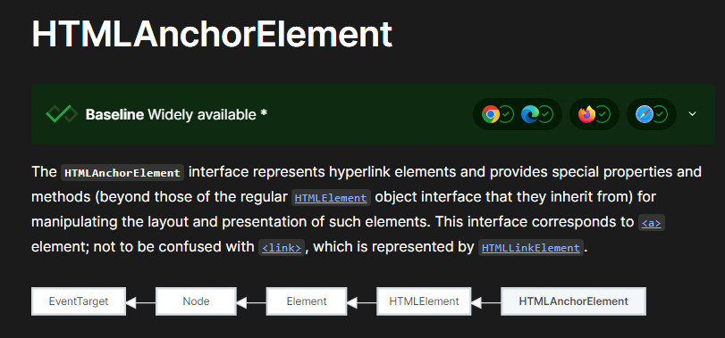

Como podemos observar na documentação, um HTMLAnchorElement, possuirá tudo que um: HTMLElement possui, Element, Node e
por sua vez, um EventTarget.

Tudo isso porque esse HTMLAnchorElement extends HTMLElement.

## querySelectorAll

Retorna uma NodeList de elementos. Não confundir o nome da interface ``NodeListOf`` com o nome da classe ``NodeList``.

Vamos ao exemplo!

```html
<a class="link" href="/">Home</a>
<a class="link" href="/produtos">Produtos</a>
<button class="link">Login</button>
```

Temos dois links com a classe link e um buttom com a mesma classe.

Ao selecionar todos os elementos com a classe ``.link``, olha o que ele retorna, uma ``NodeListOf<Element>``.


**Entenda: isso NÃO é uma Array. É uma NodeList, e o que está dentro dela são itens do tipo Element.**

### O que podemos fazer com NodeList?

Podemos, por exemplo, utilizar um forEach! Passando uma função de callback para cada elemento dentro dessa NodeList.

Filter, por exemplo, não funcionaria, pois é uma NodeList e não uma Array.

Só funcionaria se transformássemos essa NodeList em Array com ``ArrayFrom``.

```typescript
const links = document.querySelectorAll('.link')

links.forEach((link) => {
    if (link instanceof HTMLAnchorElement) {
        console.log(link.href)
    } else {
        //typeof vai retornar SEMPRE objeto.
        console.log(typeof link);
    }
});

// erro, filter é um método de Array e não de NodeList
const anchorLinks = links.filter((link) => { link instanceof HTMLAnchorElement});

// Agora sim irá funcionar, pois é uma Array.
const arrayLinks = Array.from(links);

arrayLinks.filter((link) => {
    return link instanceof HTMLAnchorElement;
})
```

## Exercício:

1 - Selecione os elementos com a classe link.

2 - Crie uma função que deve ser executada para cada elemento.

3 - Modificar através da função o estilo da color e border.

```html
<a class="link" href="/">Home</a>
<a class="link" href="/produtos">Produtos</a>
<button class="link">Login</button>
```

### Resolução:

```typescript
const links = document.querySelectorAll('.link');

function execForEachLink(elements: NodeListOf<Element>) {

    elements.forEach((link) => {

        //usamos HTMLElement para também selecionar o botão.
        //se usássemos HTMLAnchorElement, pegaria só os links.
        if (link instanceof HTMLElement) {
            link.style.border = '2px solid blue';
        }
    })
}

execForEachLink(links);
```

# Lidando com eventos e callbacks

Passamos o evento como uma string e uma função de callback no método ``addEventListener.`` A função de callback possui
um parâmetro que faz referência ao evento executado, veja:

```typescript
const button = document.querySelector('button');

//sempre recebe como argumento o evento que ocorreu.
//depois, passamos o tipo de evento, existem DIVERSOS, poderia ser só "Event", por exemplo.
function handleClick(event: MouseEvent) {
    //mostra o eixo X do local clicado.
  console.log(event.pageX);
}

//passamos geralmente dois argumentos, string (tipo de evento) e depois uma função que é utilizada de callback.
button?.addEventListener('click', handleClick);

function handleScroll(event: Event) {
  console.log(event);
}

window.addEventListener('scroll', handleScroll);
```

Geralmente começar selecionando o elemento, passa o eventListener e cria o método com a ajuda da IDE, passa os argumentos
e construa a função.

A IDE mostra os possíveis eventos desejados:


## Event e instanceof

Uma função quando criada para ser executada em diferentes tipos de eventos (evento de mouse e de touch ao mesmo tempo),
deve receber como parâmetro o tipo comum entre elas, **Event**.


```typescript
//se aqui fosse MouseEvent ou TouchEvent, não iria funcionar para os dois
function ativarMenu(event: Event) {
    console.log(event.type)

    if (event instanceof MouseEvent) {
        //só é possivel acessar essa propriedade porque fizemos o instanceOff acima
        console.log(event.pageX);
    }

    if (event instanceof TouchEvent) {
        //só é possivel acessar essa propriedade porque fizemos o instanceOff acima
        console.log(event.touches[0].pageX);
    }
}

document.documentElement.addEventListener('mousedown', ativarMenu);
document.documentElement.addEventListener('touchstart', ativarMenu);
document.documentElement.addEventListener('pointerdown', ativarMenu);
```

## This em eventos de callback (não muito recomendado)

Quando o this está dentro de uma função, ele fará referência ao objeto que executou a função em questão.

No JavaScript, o this pode ser passado como o primeiro parâmetro da função, mesmo não sendo necessário informar ele
durante a execução:

```typescript
const button = document.querySelector('button')

function ativarMenu(this: HTMLButtonElement, event: MouseEvent) {
    console.log(this.innerText);
}

button?.addEventListener('click', ativarMenu);
```

No caso em questão, o this fará referência ao objeto que está acionando a função, o ``button``.

Outra coisa, o ``this`` precisa ser informado no parâmetro da função para não ser do tipo ``any``. Então SEMPRE passamos
ele primeiro.

Quando a função for atividade eventualmente, não precisa passar o this também, só o segundo argumento:

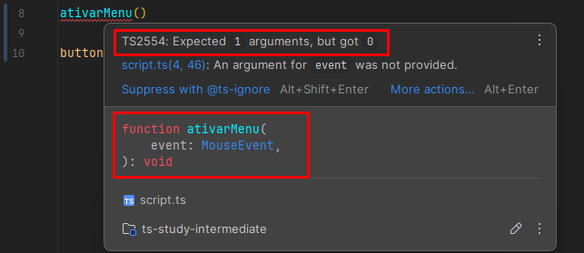

Como citamos no título, essa não é a maneira ideal de trabalhar. Para isso, utilizaremos ``target`` e ``currentTarget``.

## target e currentTarget

O typescript não executa o JavaScript, assim ele não consegue assumir qual será o target ou currentTarget do evento 
executado.

Os elementos são definidos como o tipo EventTarget, pois esse é o tipo mais comum entre os elementos que podem receber
um evento.

Portanto, para que ele funcione, precisamos verificar seu tipo, utilizando ``instanceOf``.


# Generics

**Entenda bastante essa parte, pois iremos utilizar isso bastante.**

Um tipo genérico é uma forma de declararmos um parâmetro para a nossa função, classe ou interface.

Esse tipo pode ser indicado no momento do uso da função através do ``<Tipo>``, exemplo:


Pode parecer um pouco confuso a imagem acima, mas vamos aos poucos.

Nós criamos uma função, definimos que seu retorno será do tipo ``<variavel>``. Após isso, declaramos depois do parâmetro
o tipo ``:variavel`` e depois por fim, o que a função deve retornar: ``:variavel``.

Note uma coisa: estamos retornando 3 coisas para uma mesma função: string, number e boolean e mesmo assim ele consegue
identificar e deixar a gente usar os métodos de cada tipo primitivo (toLowerCase, etc), por quê?

Basicamente o que o programa faz embaixo dos planos, é criar uma nova função para cada tipo, assim:


O mesmo acontece para o number e para tipo boolean.

Poderíamos até mesmo passar o tipo direto na chamada da função:


## Generics com lista

No exemplo abaixo, criamos duas arrays de números e frutas e depois, criamos uma função para retornar os cinco primeiros
elementos.


Inicialmente, a função foi declarada para receber somente um array de number, mas e se quiséssemos receber arrays de
outros tipos?


❗IMPORTANTE: O primeiro ``<>``, **é o que está dentro da lista**, o segundo depois de ``lista:`` é o que ela vai receber
e por fim, o que ela vai retornar.

Declarando dessa forma, nós podemos utilizar métodos de array. Sem essa declaração na função, não seria possível.


## Minimizando a nomenclatura <T>

Ao invés de escrever coisas muito longas ali dentro, podemos resumir dessa maneira:


E nem sempre precisa indicar o retorno no final, a própria IDE já é capaz de identificar.

## Exemplo 3

Imagine uma função que vá retornar null ou o argumento:

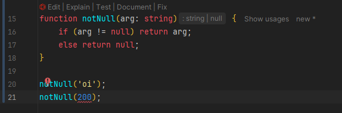

De novo, qual o problema dela? Quando passamos um number, não é possivel executar a função e nem mesmo acessar os métodos
de number! Portanto, passamos o Generics e resolvemos o problema:


## Exemplo 4 - generics com objetos


Como no exemplo acima, perfeito, estamos verificando o typeOf de string. Mas e se quiséssemos outros tipos? Boolean, 
por exemplo?


Console:


## Extends

Nós podemos indicar que o tipo genérico deve herdar de uma interface específica com o ``extends``.

**Isso é muito importante, pois imagine que a gente queira receber dados somente do tipo ``HTMLElement`` ou derivados?**


Ao passar isso, o Typescript irá saber que o "element", DEVE herdar todas as características de ``HTMLElement``.

## Métodos 

Métodos nativos são definidos utilizando generics, assim podemos indicar durante a execução qual será o tipo esperado.

```ts
//define que o retorno será um HTMLAnchorElement
const link = document.querySelector<HTMLAnchorElement>('link');
//definindo isso, podemos acessar as propriedades do link
link?.href;
```

**Entretanto, isso não quer dizer que dentro do HTML existe esse elemento, então precisa ter CUIDADO.** A forma
mais segura ao declarar tipo no selector é colocar os métodos dentro de um if!

```ts
const link = document.querySelector<HTMLAnchorElement>('link');
if (link instanceof HTMLAnchorElement) {
    link?.href;
}
```

-----

Outro exemplo, é fazendo uma requisição a uma API. Sabemos que o retorno da promise sempre será "any", visto que não
tem como saber o que de fato a API vai retornar.

Para resolver isso, podemos criar uma interface para definir o tipo, veja:

##### Antes

```typescript
async function getData(url: string) {
    const response = await fetch(url);

    return await response.json();
}


function handleData() {
    const notebook = await getData("https://api.origamid.dev/json/notebook.json");
    console.log(notebook);
}

handleData();
```

##### Depois

Passamos que a função getData (no handleData) irá receber o tipo Notebook (definido na Interface).

Já na própria getData em sí, receberá elemento do tipo <T> (ou seja, poderia ser um celular), o parâmetro continuará
string (pois é a URL) e por fim a promise também será do tipo <T>.

```typescript
async function getData<T>(url: string): Promise<T> {
    const response = await fetch(url);

    return await response.json();
}

interface Notebook {
    nome: string;
    preco: number;
}

async function handleData() {
    const notebook = await getData<Notebook>(
        "https://api.origamid.dev/json/notebook.json"
    );
    console.log(notebook);
}

handleData();
```

## Resumão Generics

É uma maneira de declarar um parâmetro em uma função/classe/interface.

Passamos esse tipo logo no ínicio da função.

```ts
function retorno<variavel>(a: string): variavel {}
```

O ``<variavel>`` é o tipo do elemento, depois o que vai dentro do parâmetro (poderia ser <varivel>) também e por fim
o que a função deve retornar.

Ao realizar isso, nossa função nos permite acessar os métodos dos tipos primitivos.

Em suma para que isso seja possível, para cada tipo utilizado, o programa cria uma função a parte.

### Com lista

Para utilizar generics com lista, é a mesma coisa! A diferença é que utilizamos no parâmetro o [].


❗IMPORTANTE: O primeiro <>, é o que está dentro da lista, o segundo depois de "lista:" é o que ela vai receber e por
fim, o que ela vai retornar.

Declarando dessa forma, nós podemos utilizar métodos de array. Sem essa declaração na função, não seria possível.

### Não precisa usar "<Tipo>"

Pode utilizar o ``<T>`` muito mais prático.

#### Veja também

- [Generics com objetos](#exemplo-4---generics-com-objetos)

### Extends

Após declarar o <T>, passamos o que ele irá extender (HTMLButtonElement, HTMLElement), e por aí vai.

[Extends](#extends)

### Métodos (QuerySelector com generics)

Podemos definir generics em método nativo (tipo querySelector), [veja](#métodos-)

# Functions

A interface da função é definida durante a sua declaração.


## Parâmetro opcional

Podemos também definir parâmetros opcionais na função, basta utilizar ``c?: number``:


## Arrow functions

```ts
const subtrair = (a: number, b:number) => a - b;

subtrair(4, 3)
```

## Definindo tipo com type

Lembrando, isso ⬇️ é um tipo, não uma função. Pode ser utilizado para definir a propriedade de um método.

```ts
type CallBack = (event: MouseEvent) => void;
```

## Tipos de retorno

Tipos em retorno em funções:

- [Void/Undefind](#void)
- [Never](#never)

### Void

No JavaScript, uma função sem return irá retornar ``undefined``. Já no TypeScript, o retorno é definido como ``void``.

Isso evita usos errados como checagens booleanas de métodos que não possuem um retorno, exemplo de erros:

```ts
//essa funcao sempre vai retornar undefined
function pintarTela(cor: string) {
  document.body.style.background = cor;
}

pintarTela('black');

// Erro, void não pode ser verificado.
// pintarTela sempre vai retornar undefined, então não tem como fazer uma
//verificação booleana
if (pintarTela('black')) {
}

const btn = document.querySelector('button');

// Erro, void não pode ser verificado
if (btn && btn.click()) {
    
}
```

---

Se a função tiver qualquer tipo de retorno, ela não terá mais o void como uma opção e sim o undefined.

```ts
function isString(value: any) {
  if (typeof value === 'string') {
    return true;
  }
}

if (isString('teste')) {
  console.log('É string');
}
```

Ou seja: a função teve algum retorno? Então ela não é mais do tipo void! Porque a partir disso, ela pode ser utilizada
para verificação booleana ou para acionar algum método (dependendo do seu retorno).

### Never

O never é utilizado em casos onde a função **gera um erro ou termina a aplicação**.

```ts
//no momento, ela está como void
function abort(mensagem: string) {
    throw new Error(mensagem);
}
```

```ts
function abort(mensagem: string): never {
    throw new Error(mensagem);
}

abort("Erro ocorreu");
console.log("Tente novamente"); //esse codigo não vai acontecer, pois acima terá um erro, finalizando o programa
```

Outro exemplo de never é em métodos ``async``, onde fazemos um fetch em uma URL que não existe. Isso vai acabar quebrando
nosso código.

## Métodos

Na definição de interfaces podemos definir os métodos indicando o **tipo de dado recebido** e o seu possível **retorno**.

```ts
interface Quadrado {
    lado: number;
    perimetro(lado: number): number;
}

function calcular(forma: Quadrado) {
    //podemos acessar tanto o atributo lado, quanto o método criado
    form.lado;
    forma.perimetro(3);
}
```

## Overload

Existem funções que retornam diferentes dados dependendo do argumento.

Podemos declarar a interface dessas funções utilizando ``fuction overload``. Basta declarar a interface antes da 
definição da mesma, utilizando o **MESMO NOME**.

O Overload deve ser compatível com a função original.

```ts
//declara sem abrir {}
function normalizar(valor: string): string;
function normalizar(valor: string[]): string[];

//primeiro definimos a função e acima dela ⬆️ declaramos as outras separadas,
//fazendo o Overload
function normalizar(valor: string | string[]): string | string[] {
    if (typeof valor == 'string') {
        return valor.trim().toLowerCase();
    } else {
        return valor.map(item => item.trim().toLowerCase());
    }
}

console.log(normalizar(" Produto "));
console.log(normalizar([" Banana", "UVA   "]));
```

Realizando esse Overload, ele nos permite por exemplo, acessar as propriedades do tipo (lowerCase), no final.

**❗IMPORTANTE: se você cria um Overload, você precisa criar os outros. No nosso caso, criar uma função somente para 
``string[]``, resultaria erro na que é somente string.**

## Seletores usam Overload

Quando usamos o querySelector e passamos um seletor nele, veja:

```ts
//isso diz que ele pode retornar um HTMLAnchorElement ou null
document.querySelector('a');
```

Essa é a interface do HTMLElement, ele faz um loop em uma interface procurando o tipo que passamos, para que ele
retorne o correto.


Vamos criar uma função utilizando ela da mesma forma que o querySelector faz, veja:

```ts
function $(seletor: string): Element | null {
    return document.querySelector(seletor);
}

$('a') // vai retornar element ou null pois ele não consegue saber o que é
```

Para que ele consiga saber o que estamos selecionando, fazemos o Overload, veja:

```ts
//frisando: HTMLAnchor/Video... tudo herda de Element!
function $(seletor: 'a'): HTMLAnchorElement | null;
function $(seletor: 'video'): HTMLVideoElement | null;
function $(seletor: 'string'): Element | null; //permite selecionar uma classe
function $(seletor: string): Element | null {
    return document.querySelector(seletor);
}

$('a')?.href // agora é possivel acessar os atributos
```


# Type Guard e Control Flow

Desde o início do curso estamos fazendo o uso de Type Guard, utilizando typeof (verificando tipos primitivos) e instanceof
para verificar se um objeto herda algo de um construtor.

O Type Guard garante a Type Safety do dado dentro do bloco condicional (if). Esse processo é chamado de Type Narrowing,
ou, **estreitamento**.

O TypeScript faz o Control Flow (controle de fluxo), visando entender qual o dado dentro da condicional, veja o exemplo:

```ts
function typeGuard(value: any) {
  if (typeof value === 'string') {
    return value.toLowerCase(); // aqui ocorre o narrowing, ou seja, esse dado só pode ser string
  }
  if (typeof value === 'number') {
    return value.toFixed();
  }
  if (value instanceof HTMLElement) {
    return value.innerText;
  }
}

typeGuard('Origamid');
typeGuard(200);
typeGuard(document.body);
```

Guard garante safety, que gera o estreitamento. E todo o processo é realizado pelo TypeScript que faz o controle de fluxo.

## Operador "In"

Esse operador verifica se o objeto possui uma propriedade com o mesmo nome da string comparada "propriedade" in obj, irá
retornar true ou false.

```ts
const obj = {
    nome: "Origamid",
}

//sempre passe a propriedade como string
if ('nome' in obj) {
    console.log("Sim");
}
```

Outro exemplo, com fetch:

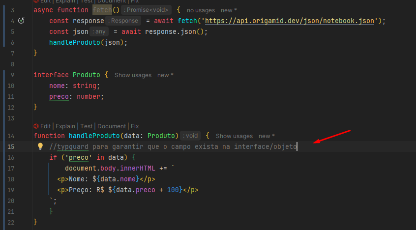

Sem esse Type Guard, por exemplo, se o campo não existisse, ele iria aparecer de qualquer jeito no HTML. Seria um campo
undefined sendo somado a 100, resultaria em um "NaN".

## Unknown

Indica que não sabemos o tipo de dado que será passado. **Ele é diferente do any!** O unknown só irá permitir o uso de métodos
quando a Type Safety estiver garantida, veja:

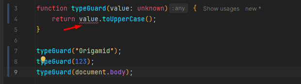

Repare que ele deixa a gente passar os valores na chamada da função, mas dentro dela, ele não permite a gente usar
o método ``toUpperCase()``.

Agora, se realizarmos a Type Safety, isto é, verificar o tipo de dado (primitivo, ou HTMLElement), será possível
utilizar os métodos:

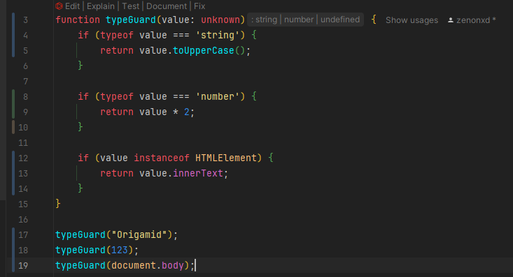


## Verificando se uma Array é de fato Array

Uma Array não pode ser verificada com typeOf, pois ela é um object.

Podemos verificar se o dado é ``instance of Array`` ou podemos usar a função ``Array.isArray()``, veja:

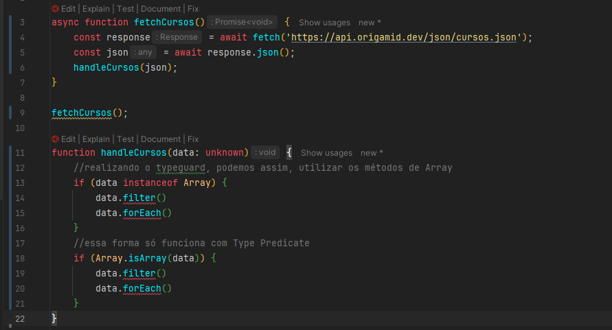

### Type Predicate (diz o tipo do dado)

Já sabemos que o TS não executa o JS durante a checagem dos tipos. Se isso ocorre, então, porque a função isArray consegue
ser usada como Type Guard, dizendo se é true ou false?

Bom, na verdade, o TS não consegue identificar. Porém, utilizando o Type Predicate ":arg is type", podemos indicar qual
o tipo de argumento, veja o exemplo abaixo:

**A partir do momento que colocamos o "is", a função se torna booleana.**

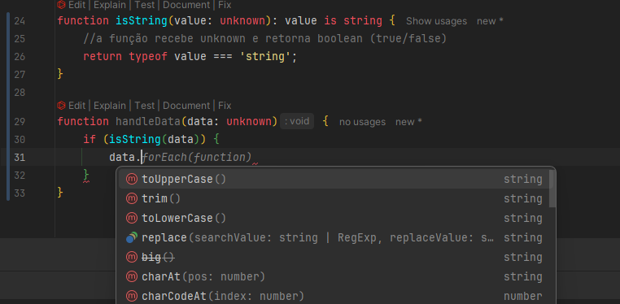

Entenda: o nosso programa NÃO está executando essa função de "isString", mas ele garante que ao rodar o código caso ela
seja true, será de fato uma string, consegue "prever" o futuro.

#### Type Predicate com objetos

O Type Predicate pode ser especialmente utilizado para criarmos Type Guards para objetos específicos e garantirmos 
a Type Safety do programa.

Utilizando em objetos, podemos verificar se os objetos possuem certos métodos ou propriedades, veja:

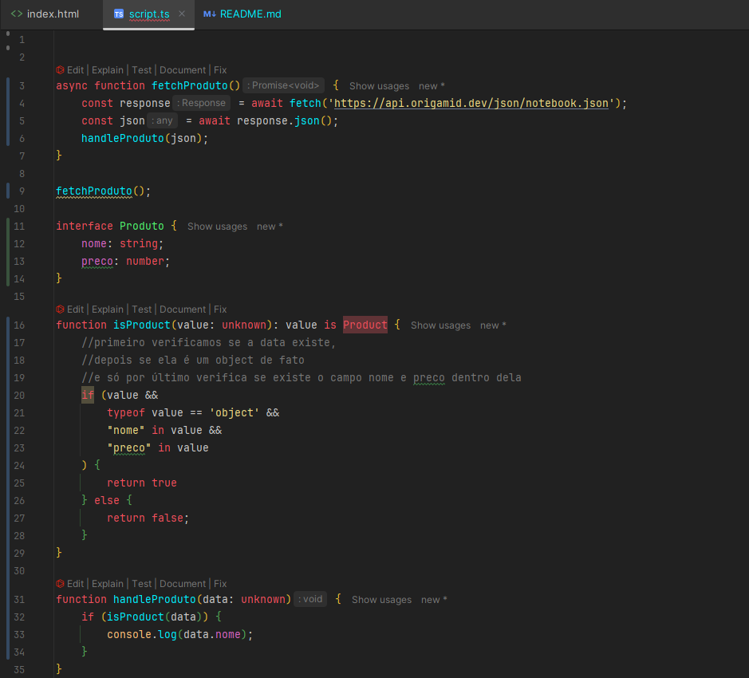

Utilizamos a função fetch de sempre, e criamos o método para verificar se de fato é um produto, utilizando este método
dentro de outra função para lidar com os dados.

## Type Assertion (as)

Com o type assertion, podemos "indicar" ao TS qual tipo de dado esperado com a palavra-chave "as". Só é possível indicar
tipos que possuem relação com o tipo original.

Devemos evitar ao máximo o uso de Type Assertion, pois a segurança (Type Safety) é perdida quando indicamos algo que nem
sempre pode ser verdade, veja o exemplo abaixo:

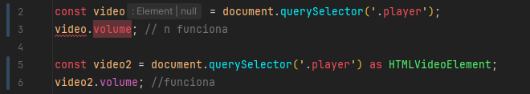

Só use quando você tem certeza ABSOLUTA que esse elemento de fato existe.

### Type Assertion com any (em Fetch)

Podemos usar o type assertion para definir que um tipo any é qualquer tipo de dado possível. Um belo exemplo disso é no
fetch.

Já comentamos que geralmente uma fetch retorna any, pois não sabemos o tipo de dado esperado, correto? Entretanto, se
estamos dando fetch em uma API de produto, nós sabemos o tipo esperado de dado e podemos indicar isso na função:

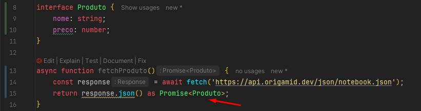

Com isso, dentro de função de handle, será possível acessar as propriedades da interface:

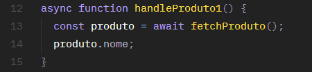

### !, non-null operator (raro utilizar)

Ele indica que não existe a possibilidade do dado ser null. CUIDADO com o uso, pois pode levar a erros no runtime. Só 
use se tiver certeza.

Esse é um operador de TS "!". e não de JS como o "?".. Durante a compilação ele será removido.

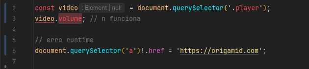

# Destructuring - Desestruturando objetos

Como desestruturar objetos indicando seu tipo de dado.

Durante a desestruturação de objetos, podemos indicar o tipo de dado com a sintaxe: { key1, key2 }: { key1: type1; key2: type2; }

Pega a propriedade de body e aloca em uma constante ⬇️


Indicando o tipo de dado a ser alocado na variável ⬇️

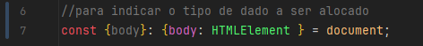

---

Entretanto, iremos utilizar mais essa sintaxe de desestruturação em funções:

Imagine uma função chamada handleData que irá receber um objeto que tem diversas propriedades, entretanto queremos
só a propriedade "nome", fariamos isso:


Para frisar e entender:

1. fazemos a desestruturação, ou seja, declarar a propriedade assim "{nome}".
2. Depois, passamos o ":", abrimos um objeto, definimos o nome e seu tipo de dado.

``({nome}: {nome: string})``

Se tivesse mais propriedades a serem desestruturadas:

``({nome, preco}: {nome: string; preco: number})``

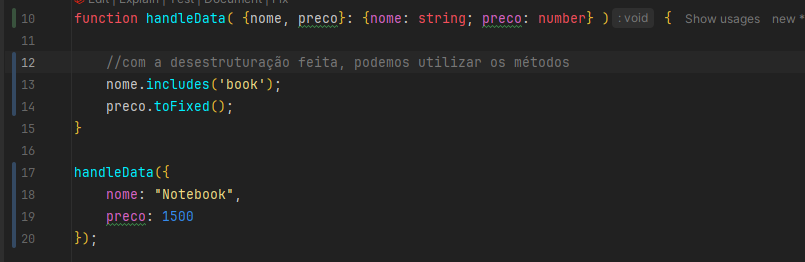

Por fim, caso essa declaração fique muito grande, é só criar uma interface, ficará assim:

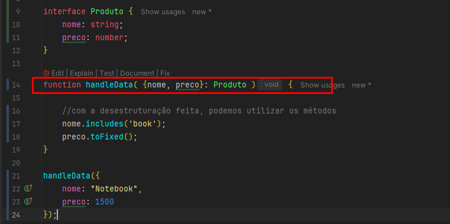

Permanece a desestruturação, com a interface depois.

## Cuidado, conheça os dados

Quando você começa a desestruturar, é necessário indicar o tipo exato do dado esperado pelo TS. Exemplo: um currentTarget
pode ser EventTarget | null, veja:

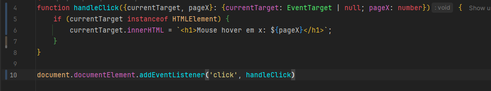

O currentTarget (onde estamos clicando na tela), ele vai retornar um HTMLElement ou null, então precisamos declarar isso
no parâmetro da função.

Mesma coisa com o pageX, esperamos dele um number.

Adendo: só será possível acessar as propriedades de "currentTarget" se fazermos o type safety com o if.

## ...rest

O operador "...rest" retorna uma Array.

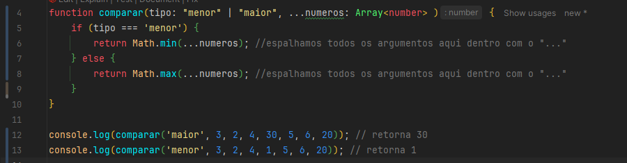

# Intersection (&)

Quando temos um "type" (tipo) e queremos extender ele.

Funciona em parte como o "extends" para interfaces, mas pode ser utilizado em Types.

Se tivéssemos utilizando "|" ao invés de "&", não seria possivel acessar as propriedades, pois daí seria "ou um, ou outro".

## Adicionando propriedades ao type com (&)

É possível adicionar uma propriedade a uma interface/tipo que já definido.

### Com types

Não é possivel reutilizar o nome! Na interface, sim, é possível.

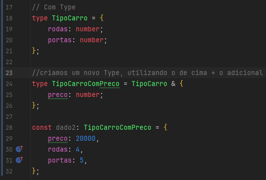

### Com interface

Já em interface é diferente, para adicionar uma propriedade desejada precisamos REESCREVER com o mesmo nome da interface
de cima.

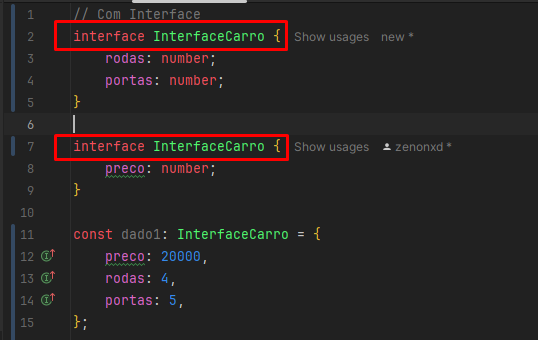

# Anotações para resumo final

Instanceof é para:

typeof é para:

A melhor forma de se lidar com dados que vem de fora (tipo dando fetch numa API), é utilizando "unknown" no parâmetro.
Isso porque não fazemos a menor ideia do tipo de dado que será retornado dessa API.

E após isso, dentro da função, podemos utilizar Type guard para manipular os dados.

```ts
function handleCursos(data: unknown) {
    //realizando o typeguard, podemos assim, utilizar os métodos de Array
    if (data instanceof Array) {
        data.filter()
        data.forEach()
    }
    //essa forma só funciona com Type Predicate
    if (Array.isArray(data)) {
        data.filter()
        data.forEach()
    }
}
```
